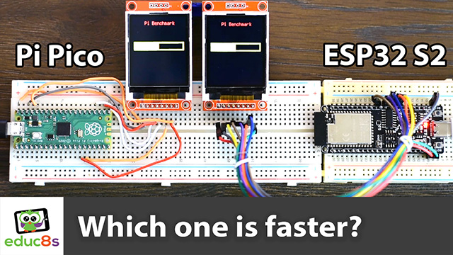

# CircuitPython-Pi-Calculation-Benchmark
This is a CicruitPython script I use to test the performance of various microcontrollers using an ST7735 display to display the results.

# Full Instructions Video

  

🎥 <a href="https://www.youtube.com/watch?v=bTYQ_Jrpz6Y">Video Tutorial on YouTube</a>

 
 

| 📺 <a href="https://www.youtube.com/educ8s">YouTube</a>
| 🌍 <a href="http://www.educ8s.tv">Website</a> |  

# Parts Needed

The parts needed in order to build this project are the following:

🛒  ESP32 S2: http://educ8s.tv/part/esp32s2

🛒  Raspberry Pi Pico: http://educ8s.tv/part/RaspberryPiPico

🛒  Display: http://educ8s.tv/part/7735
